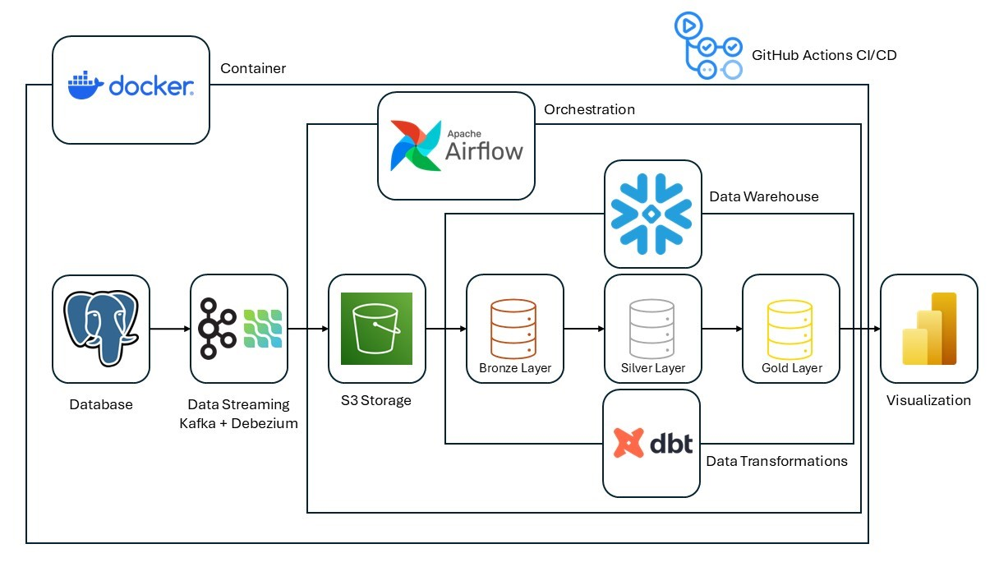
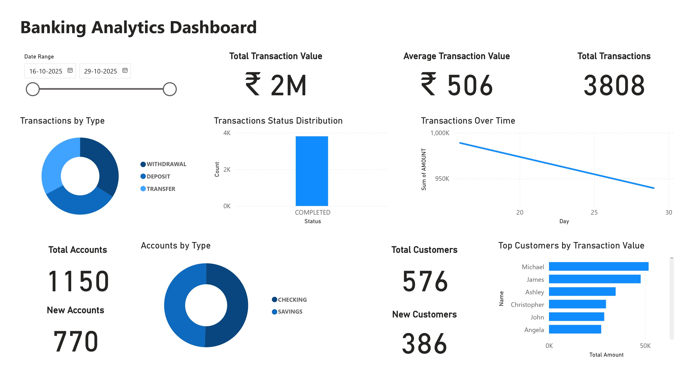

# Real-Time Banking Data Pipeline

## Overview
This project demonstrates a **real-time data engineering pipeline** built for a simulated banking environment.  
It highlights how modern tools can work together to enable **streaming data ingestion**, **automated orchestration**, **cloud-based transformation**, and **business intelligence** — combining containerized infrastructure with external cloud services for a complete end-to-end data solution.

The pipeline captures **banking transactions**, **accounts**, and **customer activity** from a PostgreSQL source database and delivers analytics-ready data into **Snowflake**, where it powers dynamic dashboards in **Power BI**.

---

## Architecture

### Pipeline Flow
1. **Data Generator** → Simulates banking transactions, accounts, and customer data using Faker.  
2. **PostgreSQL (OLTP Source)** → Acts as the main database for storing transactional data.  
3. **Kafka + Debezium (CDC)** → Captures and streams real-time change data (inserts/updates/deletes) from PostgreSQL.  
4. **MinIO (S3-Compatible Storage)** → Receives streamed data from Kafka as an intermediary storage layer.  
5. **Apache Airflow** → Orchestrates:
   - A DAG that runs every minute to move data from MinIO to Snowflake.
   - Another DAG that runs daily to trigger dbt transformations inside Snowflake.
6. **Snowflake (Data Warehouse)** → Stores data in three layers:
   - **Raw (Bronze)** – Unprocessed ingestion data.  
   - **Cleaned (Silver)** – Validated and structured datasets.  
   - **Business Ready (Gold)** – Analytics-ready marts for BI consumption.  
7. **dbt (Data Build Tool)** → Performs SQL-based transformations, builds data models, and applies snapshotting logic (SCD Type-2).  
8. **Power BI** → Connects directly to Snowflake for interactive dashboards and analytics.

---

## Technology Stack
| Layer | Tools & Technologies |
|-------|----------------------|
| **Database (OLTP)** | PostgreSQL |
| **Data Streaming (CDC)** | Kafka + Debezium |
| **Data Storage** | MinIO (S3-compatible) |
| **Data Warehouse** | Snowflake |
| **Data Transformation** | dbt (Snowflake adapter) |
| **Orchestration** | Apache Airflow |
| **Containerization** | Docker (Single Compose setup) |
| **Visualization** | Power BI |
| **CI/CD** | GitHub Actions |

---

## Key Highlights
- **Hybrid Architecture:** Core pipeline components run in Docker for easy orchestration, while data transformation and analytics leverage cloud-native services.  
- **Real-Time Data Streaming:** Debezium continuously monitors PostgreSQL for changes and publishes events to Kafka topics.  
- **Scalable Orchestration:** Airflow automates ingestion and transformation tasks on separate schedules.  
- **Modular Data Layers:** Snowflake organizes data in medallion architecture for flexibility and governance.  
- **Automated Transformations:** dbt ensures version-controlled SQL transformations and reproducible analytics.  
- **Visualization Ready:** Power BI connects directly to Snowflake, enabling up-to-date reporting.  
- **CI/CD Enabled:** GitHub Actions performs dbt project validation and automates model deployment, simulating enterprise-ready continuous integration workflows.

---

## Airflow DAGs

### 1. **`MinIO to Snowflake DAG`**
- **Schedule:** Every minute  
- **Purpose:** Downloads new Parquet files from MinIO and loads them into the RAW Snowflake tables for downstream processing. 
- **Key Operators:** PythonOperators to download data from MinIO and load it into Snowflake.

### 2. **`dbt Transformations DAG `**
- **Schedule:** Daily  
- **Purpose:** Runs dbt models to transform data from *Cleaned* to *Business Ready* layers.  
- **Key Operators:** BashOperator executing dbt commands inside the container.

---

## CI/CD with GitHub Actions
- **Continuous Integration (CI):** Each push or pull request triggers a workflow that validates the dbt project structure and dependencies before deployment.
- **Continuous Deployment (CD):** Demonstration workflow that deploys dbt models to Snowflake automatically.  
- **Future Scope:** The same setup can be extended for: 
  - Container image builds & version tagging  

---

## Power BI Dashboard

Power BI connects directly to **Snowflake** to visualize:
- Real-time transaction metrics  
- Accounts and Customers metrics  
- Customer growth trends

---

## Future Enhancements
- Implement full CI pipelines for dbt tests and Airflow DAG validation..  
- Introduce monitoring using Prometheus + Grafana.
- Add data quality checks with Great Expectations.
- Extend synthetic data generation for more complex banking scenarios.

---

## Contact
- **Author:** Abhishek Tarun 
- **Email:** [abhishek.tarun09@gmail.com](mailto:abhishek.tarun09@gmail.com)

---

